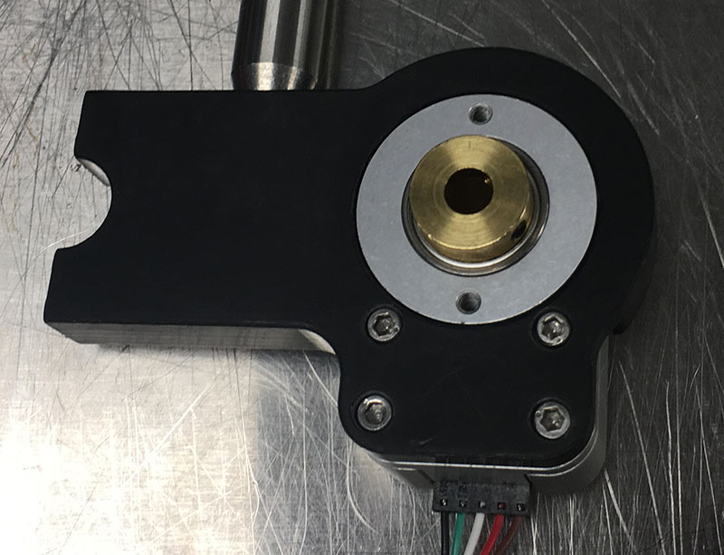

# 2. Prepare 3D printed parts
{: .no_toc }

## Table of contents
{: .no_toc .text-delta }

1. TOC
{:toc}

---

## Tap mounting adapters

Tap the Arduino and WAV Trigger mounts with #4-40 threads. Four locations per mount, as indicated with the yellow circle below:
.

Next, tap the side of the BNC panel mount with #8-32 thread. You'll need two pieces per setup:

## Assemble the encoder and wheel

Insert a #8-32 nut into the slot of the encoder mount. This allows you to connect the mount with a standard Thorlabs 1/2" diameter post:

Next, mount the HB5M encoder using four #4-40 screws:
.
