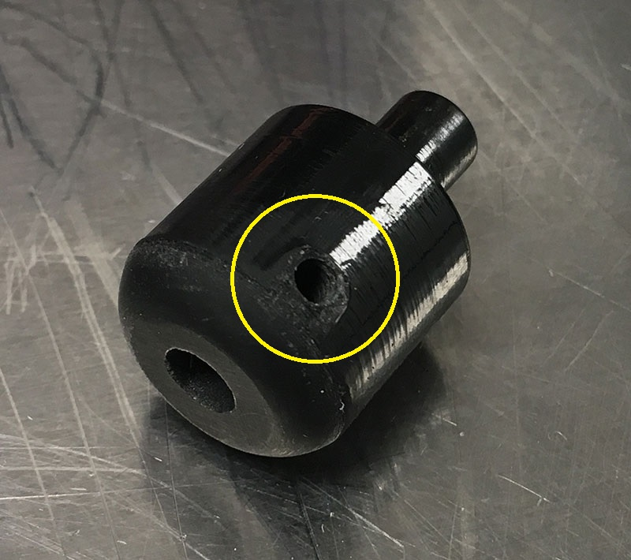

# 2. Prepare 3D printed parts
{: .no_toc }

## Table of contents
{: .no_toc .text-delta }

1. TOC
{:toc}

---

## Tap mounting adapters

Tap the [Arduino](https://github.com/kimtonyhyun/active_avoidance/blob/master/stl/arduino_mega_mount.stl) and [WAV Trigger mounts](https://github.com/kimtonyhyun/active_avoidance/blob/master/stl/wavtrig_mount_rev2.stl) with #4-40 threads. Four locations per mount, as indicated with the yellow circle below:
.

Next, tap the side of the [BNC panel mount](https://github.com/kimtonyhyun/active_avoidance/blob/master/stl/aa_panel_adapter.stl) with #8-32 thread. You'll need two pieces per setup:

---

## Assemble the encoder and wheel

Insert a #8-32 nut into the slot of the [encoder mount](https://github.com/kimtonyhyun/active_avoidance/blob/master/stl/holder_usdigital_base.stl). This allows you to connect the mount with a standard Thorlabs 1/2" diameter post:

Next, mount the HB5M encoder using four #4-40 screws:
.

Thread the "side" holes of the [wheel adapter](https://github.com/kimtonyhyun/active_avoidance/blob/master/stl/wheel_adapter.stl) with a #4-40 tap, as shown below:

Use a #4-40 set screw to secure the wheel adapter to the stem of the InnoVive wheel:

Finally, secure the wheel and adapter to the encoder by using the set screws of the encoder:

