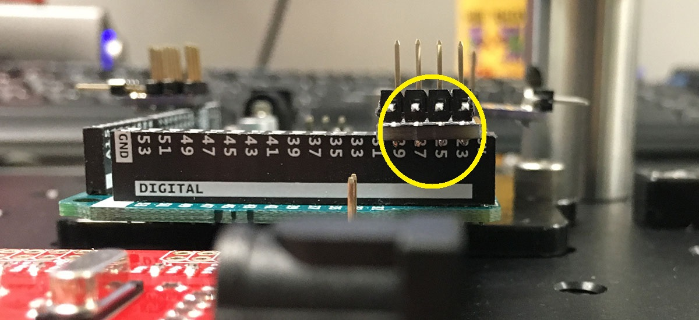

# 3. Bottom side of the apparatus
{: .no_toc }

## Table of contents
{: .no_toc .text-delta }

1. TOC
{:toc}

---

## Initial placement

Place elements on the bottom-side of the apparatus, as shown below. The board shown is the [MB8](https://www.thorlabs.com/thorproduct.cfm?partnumber=MB8):
.

Some comments:
- For the four legs, I recommend using at least 2 inch tall posts (e.g. [RS2P](https://www.thorlabs.com/thorproduct.cfm?partnumber=RS2P)).
- The WAV Trigger mount needs to be screwed on with "low-profile" (i.e. smaller head) #1/4"-20 screws, for example [92220A182](https://www.mcmaster.com/92220a182) from McMaster-Carr.
- The panel mounts also need low-profile screws, but longer lengths. For example: [92220A185](https://www.mcmaster.com/92220a185) from McMaster-Carr. (I recommend stocking multiple lengths.)

Next, mount the WAV Trigger board using #4-40 screws as follows. In the picture, I also mounted the three "4pin-bus" circuit boards on the Arduino:
.

## Place the 4pin-bus boards on the Arduino

Here are more detailed photographs showing the placement of the three "4pin-bus" circuit boards.

First "4pin-bus" board goes on pins 2, 3, 4, 5 of the Arduino:

The second "4pin-bus" board goes on pins 23, 25, 27, 29 of the Arduino:

The final "4pin-bus" board goes on 5V, GND, GND, Vin pins of the Arduino:

## Wire up the BNC panel

First, mount the populated BNC panel onto the board using #8-32 screws on the adapters:

I use a 2x1 male header pin to connect the gray wire (center pole of the switch) to pin 13 of the Arduino, and the green/yellow wire (panel ground) to the adjacent GND pin of the Arduino.

I use a 1x1 female header socket to connect the red wire (scope enable) to pin 23 of the Arduino. Similarly, the orange wire (US) is connected to pin 29 of the Arduino.

## Wire up the WAV Trigger

We first need to provide power to the WAV Trigger board. From the Arduino board, I tapped off 5V (red wire) and GND (green/yellow wire) and routed it to the power input pins of the WAV Trigger board:

Next, I connected pin 27 of the Arduino ("CS" signal) to the trigger input ("T1") of the WAV Trigger board. In the photo below, this connection is made with a blue wire:

Finally, if you are planning on using an OEM speaker module, you can connect that to the WAV Trigger board as shown below:

## Wire up the encoder

The pinout for the HB5M encoder can be seen on the bottom side of the device. Signals "A", "B", and "I" are encoder readouts, whereas "5V" and "GND" are power lines:

On the Arduino side, the encoder power wires (red and black) are routed to the "5V" and "GND" pins of the Arduino. As for the encoder signals:
- Encoder A (white) is routed to Arduino pin 2,
- Encoder B (brown) is routed to Arduino pin 3,
- Encoder I (green) is routed to Arduino pin 4.

## Wire up Saleae

Position the Saleae as shown below. I use double sided tape (the ["Nitto" tape](https://www.amazon.com/Nitto-Permacel-P-02-Double-Coated/dp/B000QC2442/) works particularly well) to secure the Saleae to the platform:

