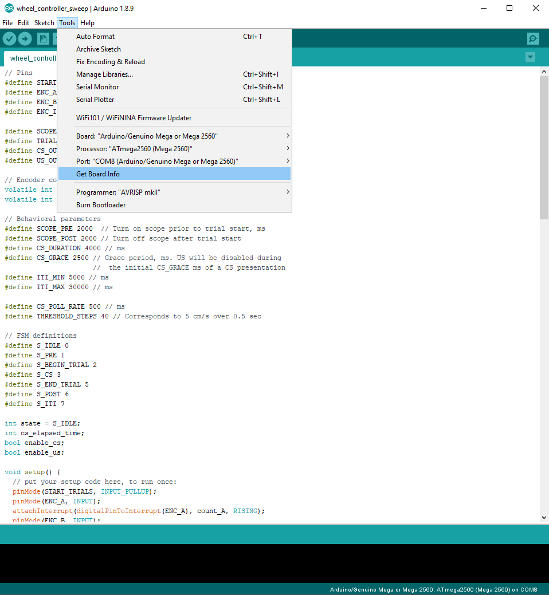

# 5. Final prep
{: .no_toc }

## Table of contents
{: .no_toc .text-delta }

1. TOC
{:toc}

---

## Program the Arduino

Open the apparatus firmware ([wheel_controller_sweep.ino](https://github.com/kimtonyhyun/active_avoidance/blob/master/wheel_controller_sweep/wheel_controller_sweep.ino)) in the Arduino IDE.

Connect the Arduino to the computer using a USB cable. You may need to adjust the Arduino parameters (i.e. we are using the Arduino Mega 2560 board) in the "Tools" dropdown menu, as shown below:

After setting the board parameters, upload the firmware ("sketch") onto the Arduino by "Sketch --> Upload (Ctrl+U)" drop down menu.

## Run Saleae
