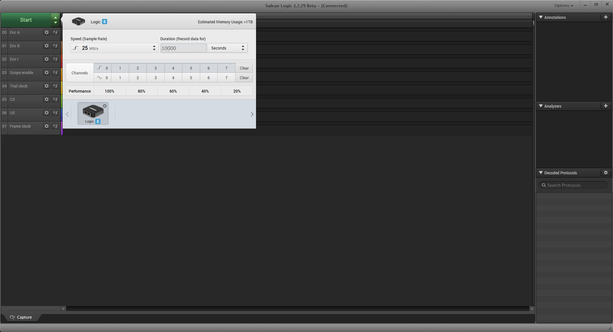

# 5. Final prep
{: .no_toc }

## Table of contents
{: .no_toc .text-delta }

1. TOC
{:toc}

---

## Program the Arduino

Open the apparatus firmware ([wheel_controller_sweep.ino](https://github.com/kimtonyhyun/active_avoidance/blob/master/wheel_controller_sweep/wheel_controller_sweep.ino)) in the Arduino IDE.

Connect the Arduino to the computer using a USB cable. You may need to adjust the Arduino parameters (i.e. we are using the Arduino Mega 2560 board) in the "Tools" dropdown menu, as shown below:

After setting the board parameters, upload the firmware ("sketch") onto the Arduino by "Sketch --> Upload (Ctrl+U)" drop down menu.

After uploading the sketch, the USB cable can be removed. The Arduino board will retain the firmware even when powered down. During regular operation, the Arduino can be powered via the USB cable or via a "wall wart" power supply (e.g. this [9V supply from Sparkfun](https://www.sparkfun.com/products/15314); though any supply from 5V to 12V will work here).

## Run Saleae

Connect the Saleae to the PC using a USB cable. In the "Logic" software (at the time of writing, I recommend using [version 1.2.29](https://support.saleae.com/logic-software/latest-beta-release)), set up the device as follows:

Note that all signals are digital. I recommend that you label each channel with meaningful names (e.g. Channel 7 is "Frame clock").

At this point, if you switch on the apparatus using the flip switch (and, of course, the Arduino is powered), then you should be able to observe the following with the Saleae, and hear the sweep tone accordingly:

## Troubleshooting

Not hearing the sweep tone?
- Is the slide switch on the WAV Trigger board set to "Run"?
