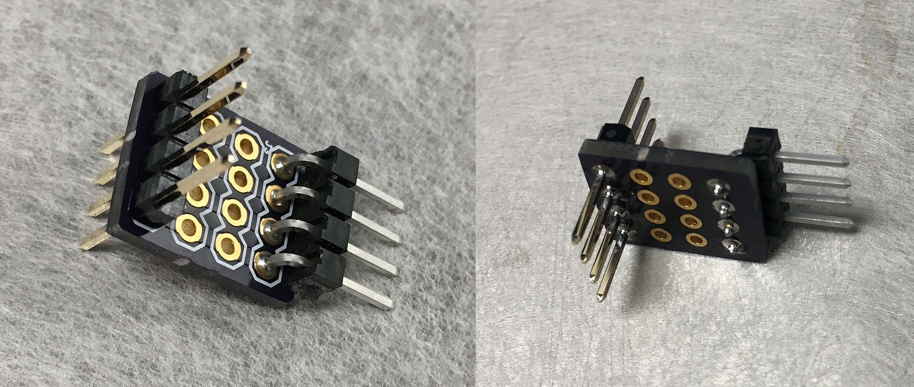
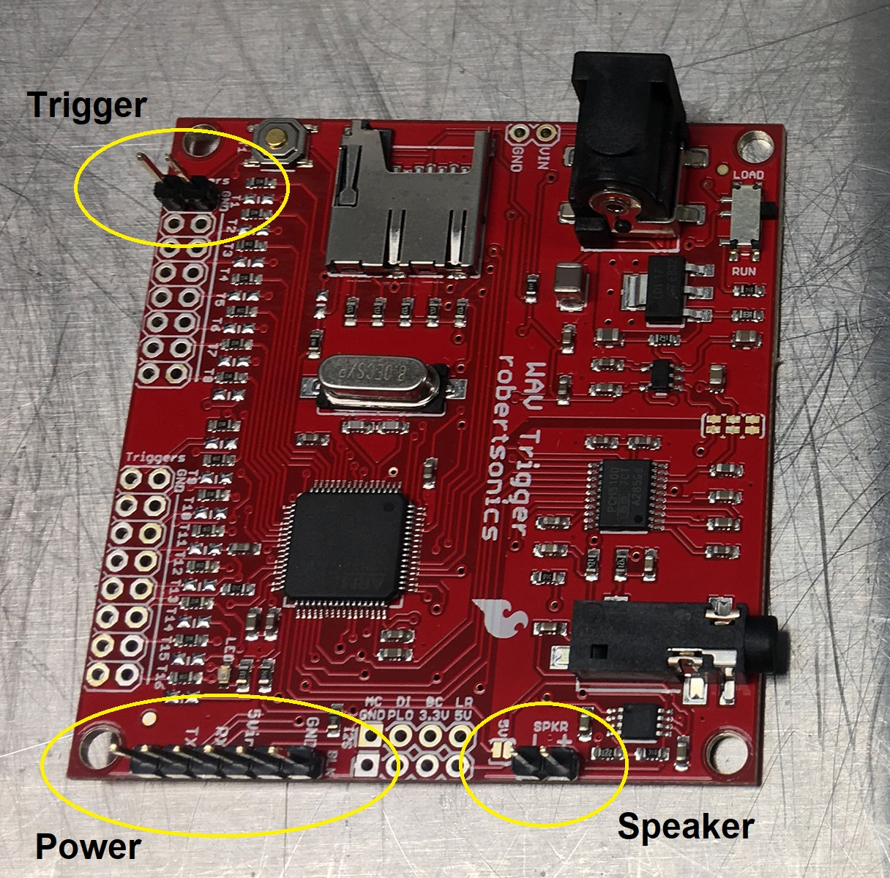
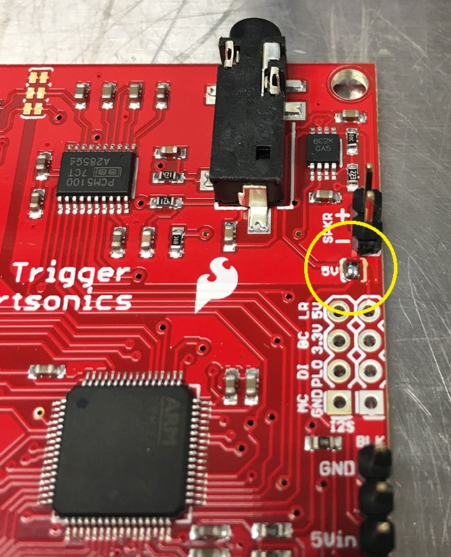
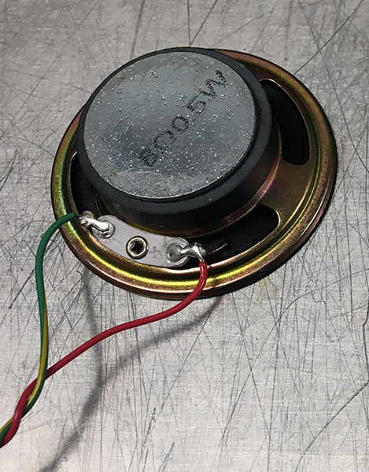

# 1. Prepare Circuits
{: .no_toc }

## Table of contents
{: .no_toc .text-delta }

1. TOC
{:toc}

---

## Prepare "4pin-bus" circuit board

Link to OSH Park where the board can be ordered: [4pin-bus](https://oshpark.com/shared_projects/qv0rC8Yo)

Solder header pins on the "4pin-bus" circuit board, as shown below:

Note that one of the header sets (left one, in above picture) protrudes bidirectionally.

This small circuit board lets us conveniently sample electrical signals (e.g. with Saleae). You can populate the other header slots as well, but the photo shows the minimal number of headers necessary. You can also use right angle headers (as shown) or straight ones.

We need 3 "4-pin bus" circuit boards per active avoidance setup.

## Prepare WAV Trigger board

Solder three sets of header pins on the WAV Trigger board, as shown below:

Next, apply a solder jumper to the jumper location indicated by "5V", as below:

For more information on the jumper, see [WAV Trigger user guide](https://robertsonics.com/wav-trigger-online-user-guide/#chapter1)

## Load the SD card

I use:
- [1 GB SD card from Sparkfun](https://www.sparkfun.com/products/15107), and
- [USB card reader from Amazon](https://www.amazon.com/IOGEAR-MicroSD-Reader-Writer-GFR204SD/dp/B0046TJG1U)

Using the above hardware, copy over the two files located [here](https://github.com/kimtonyhyun/active_avoidance/tree/master/sd_card) onto the SD card.

The WAV file is the auditory (linear) sweep, from 2 kHz to 6 kHz over 5 seconds. I used [this Matlab script](https://github.com/kimtonyhyun/active_avoidance/blob/master/scripts/wavegen.m) to generate the WAV file.

The INI file provides settings for the WAV Trigger board. (For more info see [WAV Trigger user guide](http://robertsonics.com/wav-trigger-online-user-guide/#chapter8).)

After the two files have been loaded onto the SD card, insert the card into the WAV Trigger board until it clicks once.

## Prepare the BNC panel

(To be continued...)

## Prepare the speaker (optional)

Solder wires onto a standalone speaker, as shown below:

